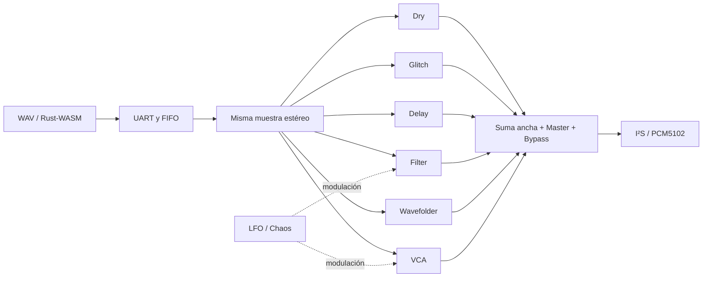

# Auditoría sonora y paralelismo — CELESTE

> Latest sonic firmware, resources and expanded tests: [SONIC_ENGINE.md](SONIC_ENGINE.md).

**Versión auditada inicial.** La ampliación posterior de bypass por componente
y dos delays se documenta en [DUAL_DELAY.md](DUAL_DELAY.md). Cambia la memoria,
el snapshot y el plazo de cálculo; las cifras de esta página describen la
versión anterior. La regresión de 54 comprobaciones también pasa en la ampliación.

Fecha: 20 de septiembre de 2026. Estado: auditoría digital y correcciones implementadas; la calidad analógica no está certificada. No hay interfaz de entrada de línea disponible para capturar el PCM5102.

## Resultado y alcance

Se sigue la cadena WAV → decodificación/remuestreo Rust/WASM → Web Serial/UART → FIFO → DSP → I²S → PCM5102. Los resultados de simulación no se presentan como medidas analógicas. La verificación física de la FPGA usa sus contadores y medidores digitales; no mide la tensión de salida del DAC.

| Capa | Evidencia | Alcance |
|---|---|---|
| Motores DSP y mezcla | 57 escenarios, 220.236 frames, 54 aserciones | RTL sintetizable real, no emulación de efectos en JavaScript |
| Matemática de mezcla | 1.966.055 comparaciones | Todo el rango de suma de seis PCM16, con ganancias límite y variables, frente a referencia de 64 bits |
| Controles dinámicos | Rutas, bypass, Master, VCA, saturación y reset | Rampa máxima observada: 63 LSB por muestra con señal constante de 16.000 |
| DSP → I²S | 128 frames estéreo bit a bit | Signo, orden, empaquetado, una muestra de entrega al serializador y deadline |
| Rust/WASM + web | 25 tests | Todos los códigos PCM16, estéreo, remuestreo, patches, protocolo, bancos, loops y cancelación |
| RTL de transporte/control | 13 bancos de pruebas integrados | FIFO, I²S, streaming, CRC, UART, CDC, DSP, encoders, touch, latencia, mezcla, transiciones |
| Navegador sin placa | Prueba de interacción real | WAV/worker/WASM, reproducción local, edición de rutas, knobs, bancos, JSON y adaptación de pantalla |
| Chrome con FPGA real | 480.000 frames exactos, cero errores | WAV → Rust/WASM → Web Serial → FIFO, finalización automática y ninguna excepción de página |
| Rust nativo | 13 tests anteriores pasan; 2 nuevos pendientes en nativo | Windows bloquea el enlazador GNU. Las 2 comprobaciones nuevas equivalentes pasan en el Rust/WASM de la aplicación |
| Analógico PCM5102 | Pendiente | Ruido, THD+N, respuesta, nivel de salida, jitter y diafonía requieren captura/instrumentación |

Los tests son una batería de regresión reproducible, no una demostración formal de todos los estados posibles ni una garantía de que cualquier equipo/navegador sostenga USB indefinidamente.

## Fallos encontrados y corregidos

| Problema reproducido | Antes | Después |
|---|---|---|
| Glitch con probabilidad 0 | Muestra anterior y errores de hasta 32.766 LSB frente al paso directo | Paso directo exacto |
| Glitch reteniendo cambios de signo | La diferencia se saturaba a 16 bits antes de interpolar; error de 29.999 LSB en el caso de prueba | Diferencia de 17 bits y producto ancho; retención exacta al 100% |
| Bypass a ganancia unidad | Error de 1 LSB respecto a la referencia | Bit a bit exacto |
| Mezcla antes de Master | Cuatro ramas de 12.000 a Master 25% daban 8.191: el recorte ya había ocurrido | 12.000, con suma ancha y saturación final |
| Residuo de filtro a cutoff mínimo | 394 LSB tras el impulso, aproximadamente −38,4 dBFS de pico | 0 LSB en los 2.048 frames finales medidos |
| Redondeos en ramas simultáneas | Diferencia de 10 LSB respecto a sumar renders individuales | Diferencia de 0 LSB en el caso de superposición |

El filtro conserva la fracción descartada en sus integradores. Esto evita zonas muertas de cuantización sin ensanchar sus multiplicadores. El mezclador mantiene 19 bits hasta aplicar la ganancia y recortar la salida. La multiplicación ancha se descompone exactamente en una parte fraccionaria 16×16 y una parte entera con desplazamientos y sumas.

Las correcciones aumentaron inicialmente el uso a 23 DSP. La optimización lo redujo a 22, conservando todas las referencias numéricas. No se ha reducido precisión para recuperar recursos.

## Cobertura de los motores

| Motor | Pruebas actuales | Límites explícitos |
|---|---|---|
| Dry / Bypass | Rampa de todo el rango, silencio, unidad exacta, Master, rampas de bypass | STOP/reset son inmediatos; no equivalen a un fade musical |
| Glitch | Probabilidad cero, retención al máximo, cambios de signo, mezcla paralela | Sample-and-hold intencionadamente no bandlimited; no es granular |
| Delay | Impulsos a 1, 257 y 8.192 muestras; cuatro ecos con feedback máximo; silencio | 0,0208–170,667 ms; feedback hasta aproximadamente 50%; cambios de tiempo no tienen crossfade de dos lectores |
| Filter | 18 combinaciones de frecuencia/cutoff/resonancia, impulsos, cola, aislamiento estéreo | Low-pass fijo; estados PCM16 con acumulación fraccionaria; no es un filtro de 24/32 bits ni tiene todos los tipos comerciales |
| Wavefolder | Cuatro drives sobre rampa completa contra función triangular independiente; silencio y suma | Sin oversampling ni antialias específico; los armónicos altos pueden plegarse |
| VCA | Ganancias 0/25/50/100%, signos, mute, modulación y rampas | Modulación actual sustractiva, no control exponencial en dB |
| LFO | Salida VCA realmente variable, profundidad cero, separación de destinos | Triangular; aproximadamente 0,05–11,77 Hz; excursión máxima de modulación ≈50% del rango del parámetro |
| Chaos | Salida VCA variable, destino Filter sin fuga al VCA, A/B físico del filtro | Pseudoaleatorio determinista; objetivo nuevo cada 4.096 muestras y transición limitada; sin control de velocidad propio |

LFO y Chaos solo controlan actualmente `filter.cutoff` y `vca.level`. El panel muestra el valor base, no la trayectoria instantánea del parámetro modulado. Con cutoff cerca del máximo, la modulación positiva puede quedar recortada. Una fuente dominada por graves puede hacer poco evidente un barrido que no alcance esos graves. Ninguna de estas observaciones sustituye a comprobar las rutas y los medidores.

## Calidad de conversión y resolución

El audio transportado y los motores trabajan en PCM16 estéreo a 48 kHz. I²S usa muestras de 24 bits en slots de 32 bits, con ocho ceros añadidos al PCM16: eso **no proporciona 24 bits efectivos**.

El decodificador acepta WAV PCM 8/16/24/32 bits y float32, mono/estéreo, 44,1/48 kHz; limita/sanea entradas y termina cuantizando a PCM16. A 48 kHz los 65.536 códigos PCM16 pasan exactamente y el canal derecho permanece cero con entrada solo izquierda.

Remuestreo 44,1 → 48 kHz, seno de amplitud 12.000, 0,2 segundos, excluyendo bordes:

| Frecuencia | Ganancia medida | Error RMS frente al seno ideal |
|---|---:|---:|
| 100 Hz | −0,000 dB | −97,74 dBFS |
| 1 kHz | −0,000 dB | −94,53 dBFS |
| 10 kHz | −0,001 dB | −91,10 dBFS |
| 18 kHz | −0,016 dB | −63,43 dBFS |
| 20 kHz | −0,107 dB | −46,98 dBFS |

Estos errores incluyen la reconstrucción y la cuantización de esta prueba; **no son THD+N analógico del DAC**. El kernel actual de 32 taps pierde calidad cerca de Nyquist. Un kernel más largo/precalculado en el host es una mejora prioritaria si se desea mayor fidelidad en 44,1 kHz. No consume DSP de la FPGA.

## Qué paralelismo existe realmente



Todas las ramas reciben la misma muestra de entrada. Ninguna recibe la salida de la anterior. Tienen estado independiente de filtro, delay, hold y modulación. Los bloques se calculan mediante lógica hardware, con un secuenciador de etapas común por muestra. Las operaciones dentro de cada etapa se ejecutan concurrentemente; que haya etapas no convierte el patch en una cadena serie de efectos.

La prueba de superposición compara la salida de seis ejecuciones independientes con una ejecución de las seis ramas activas. Coinciden muestra a muestra en un escenario que evita clipping. Las pruebas de mute y separación de destinos comprueban que habilitar una ruta no cambia el algoritmo de otra.

La netlist utiliza multiplicadores físicos y lógica combinacional; no hay un procesador ejecutando instrucciones de efectos en este diseño. Al quitar cables **no se liberan celdas ni DSP**: cambia la contribución al mezclador. Tampoco se crea una nueva instancia de hardware al dibujar un bloque.

### Latencias que se pueden afirmar

- Reloj de audio configurado: 12,288 MHz; frame de 256 ciclos = 20,833 µs.
- Cálculo DSP: salida disponible seis ciclos después de recibir la muestra, aproximadamente **0,488 µs**. El test de deadline corre al ritmo real de 256 ciclos.
- El serializador captura el resultado en el frame siguiente: **una muestra de entrega**, además del desplazamiento serie de sus slots y de la latencia propia del DAC.
- El filtro y el delay tienen su respuesta temporal propia. El delay añade el tiempo seleccionado.
- La FIFO tiene 8.192 frames, equivalentes a **170,667 ms de capacidad**. La latencia desde el host depende de su ocupación, de la preparación del WAV y del USB. No se debe anunciar 0,488 µs o «1 clock» como latencia extremo a extremo.

### Diferenciación defendible

Se puede afirmar: **procesamiento hardware de ramas paralelas, temporización del DSP acotada, controles físicos sincronizados y mezcla determinista**. Se debe acompañar de los límites de transporte y configuración medidos.

No se puede afirmar que otros productos no procesan en paralelo: el paralelismo de rutas también puede existir en software y DSP convencionales. Esta auditoría no contiene benchmarks ni mediciones de productos competidores. Tampoco permite anunciar patching ilimitado, duplicación arbitraria, cero latencia, resolución efectiva de 24 bits ni funcionamiento autónomo sin el host para los WAV.

## Recursos y versión

Build final: lógica **13.115/20.736 (64%)**, DSP **22/24 (92%)**, BSRAM **34/46 (74%)**. Setup y hold: cero endpoints violados. Solo quedan dos unidades DSP nominales; eso no equivale automáticamente a dos efectos disponibles, porque también cuentan memoria, lógica, rutas y temporización.

La nueva capacidad `0x80` identifica la aritmética auditada. GET_STATUS anuncia capacidades `255`; GET_CONTROLS mantiene 80 bytes y versión de snapshot `4`. SHA256 del bitstream cargado:

`5fb8340ceea12f024ea1b555e6dc9b1a3bdabd00d3d67c5630171bd4ce673f76`

La programación se hizo en SRAM. Reiniciar la placa puede restaurar el firmware antiguo de Flash.

## Pruebas físicas de esta versión

| Prueba | Resultado |
|---|---|
| Tono estéreo, 20 segundos, barrido de DSP | 960.000 frames enviados y consumidos; 101 cambios de control; FIFO mínima observada 2.535; actividad en las ocho lecturas de medidores; sumas PCM correctas |
| Chaos sobre filtro, tono fijo de 2 kHz | OFF: pico 272, media 267,30; ON: pico 3.444, media 2.093,86. 66 lecturas por estado, seis segundos por estado |
| Transporte sostenido, silencio, 120 segundos | 5.760.000 frames enviados y consumidos; 607 cambios de control; FIFO mínima observada 1.628 |
| Chrome, WAV de silencio de diez segundos | 480.000 frames exactos; reproducción terminada, FIFO vacía, sin excepciones JavaScript |

Todas terminaron con cero underruns, overruns y errores de protocolo. El tono
comprueba actividad digital; las pruebas de silencio comprueban transporte,
no audibilidad. La prueba Chrome utiliza Web Serial y la placa reales, sin
mock del transporte. No demuestra estabilidad indefinida ni en segundo plano.
Evidencia adicional: `build/audio-audit/hardware-browser.log` y
`build/browser-hardware.png`.

## Mejoras siguientes, por prioridad

1. **Estabilidad del transporte web.** La FIFO protege el reloj DSP, pero el navegador puede dejar de alimentarla. La caché de clips cortos y la reposición anticipada reducen esperas; no son prueba de inmunidad al throttling. Llevar el bombeo serial a un worker/servicio dedicado y ensayar ventanas en segundo plano durante 10–30 minutos antes de declarar estabilidad de producto.
2. **Telemetría útil para escuchar.** Añadir valor efectivo de cutoff/VCA, actividad LFO/Chaos y contador de saturaciones; diferenciar sin destino, profundidad cero, rama sin ruta, mezcla cero y bypass. Hoy el valor base puede parecer inmóvil aunque haya modulación real.
3. **Modulación con rango visible.** Profundidad por conexión y modo bipolar/unipolar; rangos en Hz/dB y protección frente a saturación de destino. Conservar compatibilidad de presets mediante versión de esquema.
4. **Calidad no lineal y transiciones.** Oversampling/antialias para Wavefolder, crossfade al cambiar lectura del Delay y política explícita para colas/fade al finalizar. Aprovechar ciclos disponibles por frame antes de replicar multiplicadores.
5. **Remuestreo del host.** Más taps o banco polifásico de coeficientes; umbrales más exigentes de error a 18–20 kHz. Incluir dither opcional al reducir material de mayor resolución a PCM16.
6. **Escalado del paralelismo.** Separar motores en módulos con contrato de entrada/salida y deadline; asignador de recursos reales. Dos Sample In necesitan fuentes y buffers independientes. Duplicar Delay consume memoria adicional; los 12 BSRAM libres no bastan para otra FIFO idéntica de 8.192 frames junto con cualquier memoria adicional.
7. **Validación analógica.** Entrada de línea, carga conocida y captura PCM5102: ruido, THD+N, respuesta, nivel, clipping y separación estéreo. Pendiente por falta de equipo, confirmado por el usuario.

## Cómo repetir la batería

```text
npm run build
npm test
npm run test:rtl
npm run test:audio
npm run test:rust
npm run test:browser
npm run test:all -- --browser
```

`test:audio` necesita Python con NumPy e Icarus Verilog. Se puede fijar `CELESTE_AUDIT_PYTHON`; en este equipo se detecta el runtime Python de Codex. `test:browser` necesita el servidor en `127.0.0.1:5173`. `test:all` conserva el estado de cada comando: un fallo nativo de Rust no queda oculto por tests posteriores que pasen.

Pruebas físicas, con COM14 libre y firmware preparado:

```text
python scripts/hardware_stream.py --seconds 20 --tone --diagnostics --dsp-sweep
python scripts/check_modulation_hardware.py
python scripts/hardware_stream.py --seconds 120 --diagnostics --dsp-sweep
node scripts/test-hardware-browser.mjs
```

La última abre Chrome y necesita seleccionar COM14 en su diálogo. No es sustituible por la prueba de navegador con transporte simulado ni por la prueba Python. `hardware_stream.py --dsp-sweep` cambia registros y rutas para la prueba; al terminar, reconectar la web vuelve a aplicar el patch guardado. `check_modulation_hardware.py` sí restaura explícitamente los registros que encontró.

Evidencias: `build/audio-audit/baseline.json`, `results.json`, `output.txt`, `wasm-quality.log`, `prepare-board.log`, `hardware-tone.log`, `hardware-chaos.log`, `hardware-soak.log`; compilación en `build/audio-audit-release.log`. `results.json` incluye el SHA256 del RTL probado para detectar resultados obsoletos.
